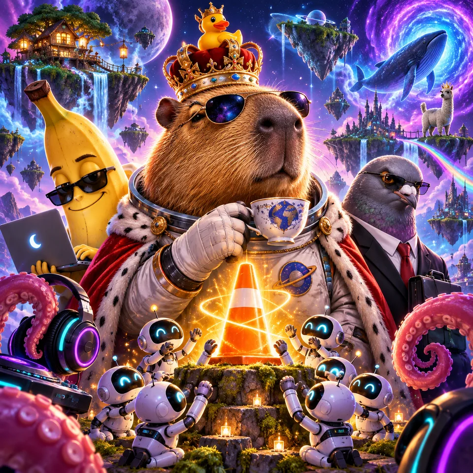
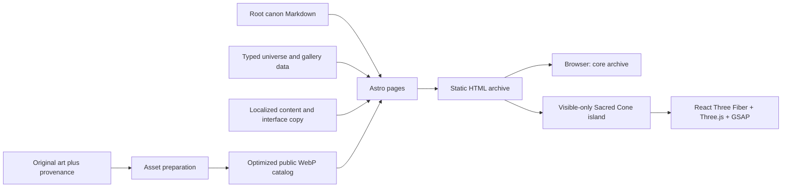

<p align="center">
  
</p>

<h1 align="center">All Hail the Cone</h1>

<p align="center"><strong>Higher Ground Awaits.</strong></p>

<p align="center">
  A public worldbuilding archive and digital experience about cosmic guidance,<br />
  interdimensional logistics, better tea, and an inexplicably important traffic cone.
</p>

<p align="center">
  <a href="https://allhailthecone.com"><strong>Explore the archive</strong></a>
  · <a href="https://discord.gg/9VyUNRk7N"><strong>Join Discord</strong></a>
  · <a href="https://ko-fi.com/allhailthecone"><strong>Support on Ko-fi</strong></a>
  · <a href="https://github.com/marquezinii/allhailthecone/discussions"><strong>Open a discussion</strong></a>
  · <a href="CANON.md"><strong>Read the canon</strong></a>
</p>

<p align="center">
  <a href="https://github.com/marquezinii/allhailthecone/actions/workflows/ci.yml"></a>
  <a href="https://allhailthecone.com"></a>
  <a href="https://discord.gg/9VyUNRk7N"></a>
  <a href="https://github.com/marquezinii/allhailthecone/releases/tag/v1.0.0"></a>
</p>

---

> **A cosmic bureaucracy held together by tea, bread, potassium, and an extraordinary faith in a traffic cone.**

In Higher Ground, a crowned capybara is the calmest monarch in the multiverse. A pigeon directs Bread Operations. A banana leads technological infrastructure. Small robots keep vigil around a Cone whose origin no record can settle. Nobody considers this unusual.

**All Hail the Cone** treats its absurdity with complete seriousness. It is a living fiction, an archive of visual references, and a deliberately restrained interactive website. The humor belongs to the audience; the world itself remains composed.



## Table of contents

- [Start here](#start-here)
- [What this project is](#what-this-project-is)
- [The world in one minute](#the-world-in-one-minute)
- [Explore the archive](#explore-the-archive)
- [Experience design](#experience-design)
- [Technical architecture](#technical-architecture)
- [Languages and localization](#languages-and-localization)
- [Artwork, identity and provenance](#artwork-identity-and-provenance)
- [Support the project](#support-the-project)
- [Run locally](#run-locally)
- [Quality gates](#quality-gates)
- [Repository map](#repository-map)
- [Contribute](#contribute)
- [Release and deployment](#release-and-deployment)
- [Security, privacy and rights](#security-privacy-and-rights)

## Start here

| If you want to…                               | Start here                                                                                                                                                                                                                        |
| --------------------------------------------- | --------------------------------------------------------------------------------------------------------------------------------------------------------------------------------------------------------------------------------- |
| Understand why the Cone matters               | [LORE.md](LORE.md)                                                                                                                                                                                                                |
| Meet the people keeping reality operational   | [CHARACTERS.md](CHARACTERS.md)                                                                                                                                                                                                    |
| Explore territories, Gates and unknown routes | [WORLD.md](WORLD.md)                                                                                                                                                                                                              |
| Read the official continuity boundaries       | [CANON.md](CANON.md)                                                                                                                                                                                                              |
| Browse the visual archive                     | [Gallery](https://allhailthecone.com/gallery)                                                                                                                                                                                     |
| See the visual rules before making art        | [ART_GUIDE.md](ART_GUIDE.md)                                                                                                                                                                                                      |
| Join the community or support the archive     | [Discord](https://discord.gg/9VyUNRk7N), [Ko-fi](https://ko-fi.com/allhailthecone), [Buy Me a Coffee](https://buymeacoffee.com/allhailthecone) or [GitHub Discussions](https://github.com/marquezinii/allhailthecone/discussions) |
| Propose a thoughtful addition                 | [CONTRIBUTING.md](CONTRIBUTING.md)                                                                                                                                                                                                |

## What this project is

This repository is the source of record for the first public edition of All Hail the Cone. It holds the narrative foundation, source artwork archive, visual-system documentation, localized site, delivery pipeline and validation suite in one place.

| Principle                        | In practice                                                                                            |
| -------------------------------- | ------------------------------------------------------------------------------------------------------ |
| **Mystery has value**            | The Cone guides, but its origin and intent are never fully resolved.                                   |
| **The absurd is ordinary**       | Characters do not perform surprise at a banana director or a pigeon COO.                               |
| **Records matter**               | Canon has explicit levels, assets have provenance, and changes should be traceable.                    |
| **The archive stays expandable** | Stable IDs, static routes and structured data leave room for stories, comics, maps and future systems. |
| **Interaction earns its cost**   | WebGL is isolated to a single purposeful scene; the archive remains fast and readable everywhere else. |

This is not a generic meme site, a content-management product, or an unfinished game pitch. It is a public creative property with a website designed to carry its own tone.

## ❤️ Support the project

If this archive has been useful or memorable, consider supporting its development.

**[Support on Ko-fi](https://ko-fi.com/allhailthecone)**

Prefer another platform? **[Buy Me a Coffee](https://buymeacoffee.com/allhailthecone)**

## The world in one minute

Long before the present archive, isolated civilizations occupied unstable worlds connected by unreliable Gates. Then **The Ascension** occurred: a plain cone on a stone platform produced a visible golden star, stabilized routes between worlds and became known as **The Sacred Cone**.

The resulting network is called **Higher Ground**. It is not exactly a country or empire. It is a civilization held together by maintained routes, shared institutions, careful ritual and the belief that there is always a way toward higher ground.

### The central figures

| Figure              | Responsibility                                     | Working principle             |
| ------------------- | -------------------------------------------------- | ----------------------------- |
| **The King**        | Capybara astronaut, monarch, explorer and diplomat | _Good Tea. Better Decisions._ |
| **The Sacred Cone** | Source of Guidance at the Sanctuary                | _Guidance, not answers._      |
| **The COO**         | Director of Bread Operations                       | _Bread Builds Worlds._        |
| **The Banana**      | Director of the Potassium Division                 | _Potassium Fuels Progress._   |
| **The Keepers**     | Small robotic Sanctuary attendants                 | _Direction confirmed._        |
| **The Maestro**     | Conductor of The Resonance                         | _Music Unites Worlds._        |

### Continuity levels

| Level           | Meaning                               | Appropriate use                                               |
| --------------- | ------------------------------------- | ------------------------------------------------------------- |
| **Canon**       | Officially established and maintained | Foundational history, verified records and named institutions |
| **Semi-Canon**  | Plausible, useful, but revisable      | Interpretations, emerging stories and provisional details     |
| **Coneposting** | Experimental, playful or unfiled      | Community experiments, sketches and delightful nonsense       |

Read the full boundaries in [CANON.md](CANON.md). No submission becomes canon merely because it is popular, polished or funny.

## Explore the archive

The website is organized as a public set of documents rather than an endless feed.

| Archive                                         | What it contains                                                                                   |
| ----------------------------------------------- | -------------------------------------------------------------------------------------------------- |
| [Lore](LORE.md)                                 | The Ascension, The First Ground, The Sanctuary and the signal declaring `HIGHER GROUND EXISTS.`    |
| [Characters](CHARACTERS.md)                     | Dossiers for the founding figures and their roles across Higher Ground                             |
| [World](WORLD.md)                               | Floating Realms, Crown City, Deep Cities, Silent Worlds, Far Ground and the Gates between them     |
| [Factions](FACTIONS.md)                         | The Order of Guidance, Bread Operations, Potassium Division, The Resonance and allied institutions |
| [Timeline](TIMELINE.md)                         | Before Guidance through the current age of unstable, unexplained routes                            |
| [Gallery](https://allhailthecone.com/gallery)   | Official visual references, source relationships and canon-aware metadata                          |
| [Identity](https://allhailthecone.com/identity) | The working visual identity and interface system                                                   |

The English edition is the primary archive. Portuguese, Mandarin Chinese, German and French editions preserve the visitor’s route when switching language.

## Experience design

The visual language is ceremonial, cosmic and precise. The content is already strange; the interface gives it discipline.

### Design DNA

| Element           | Direction                                                                  |
| ----------------- | -------------------------------------------------------------------------- |
| **Cosmic Violet** | `#9472D1` — orbital depth, mystery and distant space                       |
| **Sacred Amber**  | `#F2A836` — guidance, authority and the Cone’s light                       |
| **Cosmic Ink**    | dark negative space for contrast, depth and calm                           |
| **Cinzel**        | ceremonial display type and wordmark presence                              |
| **DM Sans**       | clear body copy, navigation and accessible utility text                    |
| **Geometry**      | orbital halos, fine archive rules, rectangular panels and measured spacing |

The signature gradient travels from amber through a warm intermediate toward violet. It is used sparingly: primary actions, CONE emphasis and transitions between light and unknown space. Body copy stays calm.

### Depth without spectacle for its own sake

The home page has one immersive Sacred Cone island. It begins as visible HTML, illustration and CSS depth. On capable non-mobile devices, it may progress to a procedural React Three Fiber scene with a bounded camera, pointer-driven light and a short scroll chapter.

- It hydrates only near its section.
- It contains no remote GLTF model or texture download.
- It pauses when off-screen or when atmosphere is paused.
- It reduces device pixel ratio, particles and antialiasing on intermediate hardware.
- It remains a static illustrated scene for mobile, reduced-motion and unsupported environments.

The rest of the archive is intentionally quieter: strong typography, source art, readable documents and native navigation. See [ART_GUIDE.md](ART_GUIDE.md) for the full visual and motion brief.

## Technical architecture



### Deliberate boundaries

| Layer                            | Responsibility                                                         | Constraint                                       |
| -------------------------------- | ---------------------------------------------------------------------- | ------------------------------------------------ |
| **Astro 7**                      | Static routes, semantic HTML, metadata and content composition         | The archive should work without JavaScript       |
| **TypeScript**                   | Typed data, locale routing and progressive interaction code            | Strict checks run in CI                          |
| **React Three Fiber + Three.js** | One procedural Sacred Cone scene                                       | Never becomes the global app shell               |
| **GSAP ScrollTrigger**           | Brief scene progression                                                | Loaded only with the qualifying immersive island |
| **CSS**                          | Layout, responsive composition, atmospheric depth and fallbacks        | Primary tool for most visual motion              |
| **Small browser modules**        | Navigation, gallery filtering, language controls and motion preference | No framework runtime on text archive pages       |

The public site is static by intention. There is no database, account system, analytics tracker, API key or user-upload endpoint in this edition. This keeps the first archive portable, privacy-respecting and cheap to operate.

For a deeper technical rationale, read [docs/ARCHITECTURE.md](docs/ARCHITECTURE.md).

## Languages and localization

| Locale              | Prefix | HTML language | Status                  |
| ------------------- | ------ | ------------- | ----------------------- |
| English             | `/`    | `en`          | Primary edition         |
| Português do Brasil | `/pt`  | `pt-BR`       | Complete static edition |
| 中文（普通话）      | `/zh`  | `zh-CN`       | Complete static edition |
| Deutsch             | `/de`  | `de`          | Complete static edition |
| Français            | `/fr`  | `fr`          | Complete static edition |

Every edition emits its own canonical URL, Open Graph locale and alternate-language links. Locale routing delegates to the same page components instead of copying layouts per language. Adding a new locale requires translated content and a locale registry entry, not an extra application tree.

## Artwork, identity and provenance

The supplied image **The First Observance** is the principal canonical visual reference. It establishes the crowned capybara astronaut, Cone, Keepers, executive pigeon, working banana, musical octopus, floating territories and cosmic administrative atmosphere.

### Source record

| Record                   | Current edition                  |
| ------------------------ | -------------------------------- |
| Original supplied files  | 25                               |
| Unique artwork records   | 23                               |
| Primary visual reference | `the-first-observance`           |
| Source archive           | `assets/originals/`              |
| Provenance and hashes    | `assets/catalog/provenance.json` |
| Public delivery assets   | `public/art/`                    |
| Gallery source of truth  | `src/data/gallery.json`          |

Originals remain byte-for-byte intact and outside the public website directory. Delivery derivatives are generated reproducibly with:

```sh
npm run assets
```

Do not edit originals. Do not turn text inside generated art into canon automatically. Preserve stable artwork IDs and source links when extending the gallery. The full policy is in [ART_GUIDE.md](ART_GUIDE.md).

## Run locally

### Prerequisites

- Node **24** — the exact runtime is declared in [`.node-version`](.node-version)
- npm — package versions are locked in [`package-lock.json`](package-lock.json)

### Development server

```sh
npm ci
npm run dev
```

Open `http://127.0.0.1:4321`.

### Production preview

```sh
npm run build
npm run preview
```

Astro writes the deployable static site to `dist/`. The preview command serves that exact output.

### Useful commands

| Command                | Purpose                                                        |
| ---------------------- | -------------------------------------------------------------- |
| `npm run dev`          | Run the local Astro development server                         |
| `npm run check`        | Validate Astro, TypeScript and React diagnostics               |
| `npm run format:check` | Confirm repository formatting                                  |
| `npm run build`        | Generate the production archive in `dist/`                     |
| `npm test`             | Verify routes, metadata, asset provenance and delivery budgets |
| `npm run test:browser` | Run Playwright and Axe checks across viewports                 |
| `npm run assets`       | Rebuild delivered artwork derivatives and catalog metadata     |

## Quality gates

The repository treats a polished page as more than a successful build.

| Gate                   | What it protects                                                                                                           |
| ---------------------- | -------------------------------------------------------------------------------------------------------------------------- |
| `npm run check`        | Type-safe Astro, React and TypeScript integration                                                                          |
| `npm run format:check` | Consistent source and documentation formatting                                                                             |
| `npm run build`        | Static route generation and production compilation                                                                         |
| `npm test`             | Metadata, canonical URLs, local links, original hashes, assets and security-budget assertions                              |
| `npm run test:browser` | Desktop, tablet and mobile navigation, no-JS fallback, WebGL boundary, gallery flow, motion state and WCAG A/AA Axe checks |
| GitHub Actions         | The complete suite for pull requests and updates to `main`                                                                 |
| Dependabot             | Monthly npm and GitHub Actions update proposals, plus automated vulnerability-fix support                                  |

Install Playwright’s browser once before running browser checks locally:

```sh
npx playwright install chromium
npm run test:browser
```

The first-edition validation record includes local, browser and public deployment evidence: [docs/VALIDATION.md](docs/VALIDATION.md).

## Repository map

```text
assets/
  originals/             Untouched founding files
  catalog/               Hashes, dimensions and provenance
public/
  art/                   Optimized delivery images and public catalog
  brand/                 Provisional interface symbol
src/
  components/            Archive UI and isolated Sacred Cone experience
  content/               Localized long-form canon documents
  data/                  Typed universe and gallery records
  i18n/                  Locale registry, translations and route helpers
  layouts/               Shared shell and document layout
  pages/                 Static pages and generated detail routes
  scripts/               Progressive browser interactions
  styles/                Design tokens, composition and motion
scripts/                 Reproducible asset preparation
tests/                   Integrity, accessibility and browser checks
docs/                    Architecture, deployment and validation records
.github/                 CI, Dependabot, ownership and issue workflows
```

### Sources of truth

- Root Markdown dossiers are the English long-form canon source.
- `src/content/{locale}/` holds localized long-form canon documents.
- `src/data/universe.ts` owns stable IDs and short card summaries.
- `src/data/gallery.json` owns public gallery metadata.
- `assets/catalog/provenance.json` owns source-file associations and integrity information.

When a canon fact changes, update every relevant source in the same pull request. A page that looks consistent but contradicts the record is not finished.

## Contribute

Contributions are welcome when they protect the world’s tone, people’s rights and the archive’s ability to grow.

1. Read [CANON.md](CANON.md), [ART_GUIDE.md](ART_GUIDE.md), [CONTRIBUTING.md](CONTRIBUTING.md) and [CODE_OF_CONDUCT.md](CODE_OF_CONDUCT.md).
2. Choose the right space:
   - **[Discord](https://discord.gg/9VyUNRk7N)** for quick community conversation.
   - **[GitHub Discussions](https://github.com/marquezinii/allhailthecone/discussions)** for durable questions, interpretations and proposals.
   - **Issues** for reproducible defects, accessibility barriers and archive corrections.
   - **Pull requests** for focused, validated code or documentation changes.
3. Keep a proposal’s canon level explicit: Canon, Semi-Canon or Coneposting.
4. Disclose source materials, collaborators and generative tools for submitted creative work.
5. Run the checks relevant to the change and record what actually passed.

Do not submit work you cannot authorize for review. Do not add tracking, secrets, unsafe collection endpoints or DNS changes as part of an unrelated contribution. The full process is in [CONTRIBUTING.md](CONTRIBUTING.md).

### Maintainer workflow

The archive has an accountable owner through [CODEOWNERS](.github/CODEOWNERS). Pull requests use a template that asks for change rationale, validation, continuity/provenance impact and rollback or accessibility risk. Merged pull-request branches are deleted automatically. No branch protection rule was added in this edition, so the current single-maintainer delivery flow remains unblocked.

## Release and deployment

| Concern                                   | Source of record                                                          |
| ----------------------------------------- | ------------------------------------------------------------------------- |
| Official canonical target                 | `https://allhailthecone.com`                                              |
| Public preview verified for First Edition | `https://allhailthecone.vercel.app`                                       |
| Hosting configuration                     | [`vercel.json`](vercel.json)                                              |
| Production output                         | `dist/`                                                                   |
| Release notes                             | [GitHub Releases](https://github.com/marquezinii/allhailthecone/releases) |
| Deployment status and handoff             | [docs/DEPLOYMENT.md](docs/DEPLOYMENT.md)                                  |

The Vercel configuration is checked in, but automatic Git deployment and official-domain association require authenticated project access. Do not change DNS speculatively. Inspect existing records, use the exact target Vercel provides, preserve unrelated records and verify the actual public root, deep routes, 404, sitemap, images and security headers after every production release.

Static output makes rollback simple: promote the last verified deployment or rebuild a prior Git tag. No database migration is involved.

## Security, privacy and rights

### Security

Private vulnerability reporting, Dependabot alerts, automated security fixes and secret-scanning push protection are enabled on GitHub. Report a vulnerability privately using [SECURITY.md](SECURITY.md); never disclose exploit details, tokens or personal data in Issues, Discussions or Discord.

### Privacy

The first edition has no analytics tracker, no user account system, no database and no required secret. The only client-side persistence is the visitor’s browser-only motion preference. The interface honors reduced-motion settings and core archive navigation works without JavaScript.

### Rights

The repository is publicly visible, but original project code, writing, identity and artwork are **rights-reserved**. Public access is not a general permission to reuse, redistribute, modify, sell or sublicense those materials. Third-party dependencies and font software retain their own licenses. See [LICENSE](LICENSE) for the exact notice.

## The direction ahead

The architecture deliberately leaves room for more without pretending that every future feature exists today: stories, comics, maps, cards, events, animation, a wiki, an ARG and community systems can begin only when they have a concrete editorial need, an accessible interaction model, moderation and a reliable source of truth.

Until then, the work is simpler:

> **Preserve the record. Maintain the routes. Make room for the unknown.**

<p align="center"><strong>The Cone remains.</strong></p>
